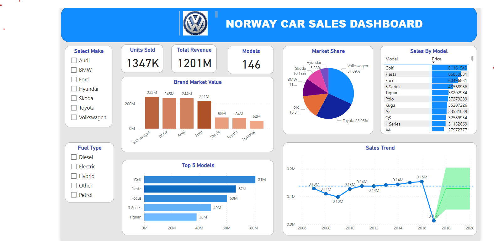

# Car Sales Report

## Overview

This Car Sales Report provides comprehensive insights into the sales data of various car models, with dynamic features such as slicers for car make and fuel type, time series analysis for year and quantity sold, brand market values, top 5 models, market share, and key performance indicators (KPIs) including units sold, total revenue, total models in make, and sales by model.

## Features

### 1. Slicers for Car Make and Fuel Type

   - Use slicers to filter and analyze data based on car make and fuel type. This allows for dynamic exploration of specific segments of the market.

### 2. Time Series Analysis for Year and Quantity Sold

   - Visualize the time series trends for car sales over different years, providing a historical perspective on quantity sold.

### 3. Brand Market Values

   - Understand the market values of different car brands, providing insights into the overall brand performance in terms of sales and revenue.

### 4. Top 5 Models

   - Identify the top 5 best-selling car models, helping to focus on the most popular choices among consumers.

### 5. Market Share

   - Analyze the market share of each car make and fuel type, aiding in strategic decision-making for market positioning.

### 6. Key Performance Indicators (KPIs)

   - - **Units Sold:** The total number of car units sold.
   - - **Total Revenue:** The overall revenue generated from car sales.
   - - **Total Models in Make:** The count of unique car models within each make.
   - - **Sales by Model:** Detailed breakdown of sales for each car model.

## Instructions for Using the Report

1. **Slicers:**
   - Use the slicers provided to filter data based on your preferences for car make and fuel type.

2. **Time Series Analysis:**
   - Explore the time series charts to understand how car sales have evolved over different years.

3. **Brand Market Values:**
   - Review the brand market values to gain insights into the performance of various car brands.

4. **Top 5 Models:**
   - Identify the top 5 models that have consistently performed well in terms of sales.

5. **Market Share:**
   - Analyze the market share charts to understand the distribution of sales across different car makes and fuel types.

6. **Key Performance Indicators (KPIs):**
   - Keep an eye on the KPIs section for a quick overview of important metrics such as units sold, total revenue, total models in make, and sales by model.

## Data Sources

Ensure that the report is connected to the latest data source to provide accurate and up-to-date information.

Feel free to explore the various visualizations and insights presented in this report to make informed decisions related to car sales.
